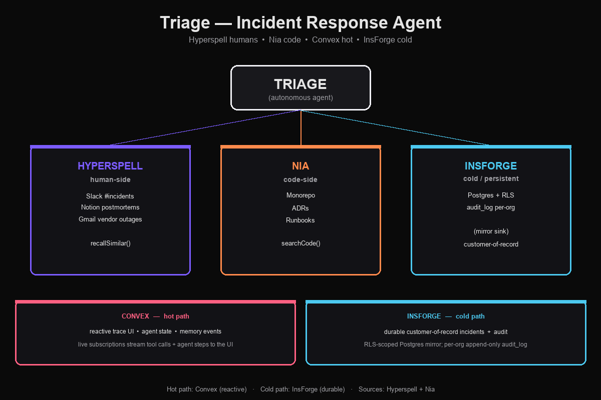

# Triage — incident-triage AI agent

> When an incident fires, Triage drafts the post-mortem in 4 seconds — and gets faster every time.

Paste a stack trace. In ~2s: a cited triage joining your team's Slack +
Notion + Gmail (via Hyperspell) with your monorepo + ADRs + runbooks
(via Nia), persisted in Convex with audit-grade RLS in InsForge for the
production story. On a similar alert minutes later, recall is sharper
because the matched memories were reinforced.

Submitted to **Track 4 — The Company Brain** (Nia + Hyperspell), targeting
the Hyperspell, Convex, InsForge, and overall prizes from a single codebase.

---

## Live demo

**https://nozomio-hackathon-dun.vercel.app**

Default mode is `DEMO_MODE=replay` — no API keys required. Click the
"Sample Trace A" / "Sample Trace B" buttons to see the cited triage and
the reinforcement wow moment.

| Inspector | Link |
|---|---|
| GitHub | https://github.com/nihalnihalani/nozomio-hackathon |
| Vercel | https://vercel.com/alhinais-projects/nozomio-hackathon |
| Convex dashboard | https://dashboard.convex.dev/d/superb-wildcat-347 |

---

## Architecture

[](docs/architecture.png)

```
                          ┌─────────────────────────────┐
                          │       TRIAGE (agent)        │
                          │   lib/agent/loop.ts         │
                          └──────────────┬──────────────┘
                                         │
              ┌──────────────────────────┼──────────────────────────┐
              │                          │                          │
              ▼                          ▼                          ▼
    ┌──────────────────┐      ┌──────────────────┐      ┌──────────────────┐
    │   HYPERSPELL     │      │       NIA        │      │     INSFORGE     │
    │  human-side      │      │  code-side       │      │  cold/persistent │
    │                  │      │                  │      │                  │
    │  Slack #incidents│      │  Monorepo        │      │  Postgres + RLS  │
    │  Notion          │      │  ADRs            │      │  audit_log       │
    │   postmortems    │      │  Runbooks        │      │   per-org        │
    │  Gmail vendor    │      │  Recent commits  │      │                  │
    │   outages        │      │                  │      │                  │
    │  recallSimilar() │      │  searchCode()    │      │  mirror sink     │
    └──────────────────┘      └──────────────────┘      └──────────────────┘

           Hot path: Convex (reactive trace UI, agent state, memory events)
           Cold path: InsForge (durable customer-of-record incidents + audit)
```

| Sponsor | Job |
|---|---|
| **Hyperspell** | Multi-source memory recall across Slack/Notion/Gmail (Nia doesn't index conversations) |
| **Nia** | Code-aware repo + ADR + runbook search (Hyperspell doesn't index code) |
| **Convex** | Reactive agent state + live trace UI via `useQuery` (`triageRuns`, `toolCalls`, `citations`, `memoryEvents`) |
| **InsForge** | Cold-path Postgres mirror with multi-tenant RLS per org |

---

## Quick start

```bash
npm install
cp .env.example .env       # see SETUP_CHECKLIST.md for getting keys
npm run dev                # open http://localhost:3000
```

That's it. `.env` already has `DEMO_MODE=replay` so the demo runs with
zero API keys. Paste Trace A or Trace B sample buttons in the UI.

### How to demo (90 seconds)

1. Click **"Sample Trace A"** → ~2s cited triage with timeline, root cause, suspected fix
2. Click **"Sample Trace B"** (or "Run on similar alert") → ~1s triage, surfaces a 🧠 NEW citation reinforced by Trace A
3. Click any citation pill → side drawer shows the raw Slack/Notion/code excerpt
4. Paste random text → graceful error, no fabrication

### npm scripts

| Command | Purpose |
|---|---|
| `npm run dev` | Next.js dev server |
| `npm run dev:all` | Next + `npx convex dev` together |
| `npm test` | Vitest suite (35 tests) |
| `npm run typecheck` | `tsc --noEmit` |
| `npm run check:invariants` | The 6 invariant gates |
| `npm run build` | Next 15 production build |
| `npm run prewarm` | Pre-cache Hyperspell/Nia replay fixtures |
| `npm run ingest` | Ingest seed data into a real Hyperspell workspace |

---

## Invariants (enforced by tests + Codex review)

The 4 rules every change must preserve. See `CLAUDE.md` for the rationale,
`tests/invariants/` for the gate scripts.

1. **Cite-or-die** — every non-trivial claim has a `verified: true` citation
   pointing to a real Slack/Notion/Gmail memory or `file:line`. Bogus input
   emits `event: error`, never fabricates.
2. **Reinforcement is the demo** — only `convex/reinforceNode.ts` writes
   `triage_history` memories. Trace B must surface at least one citation
   that Trace A didn't.
3. **Hot/cold split** — Convex hosts ephemeral agent state; InsForge holds
   durable per-org records. Mirror is one-way (Convex → InsForge).
4. **Hermetic replay mode** — every outbound call has a `DEMO_MODE=replay`
   branch. Default is `replay`. Missing keys force replay; never throws.

---

## Tech stack

```
Frontend:        Next.js 15.1.12 (App Router) · TypeScript · shadcn/ui · Tailwind
LLM:             OpenAI gpt-5.5 (reasoning model; reasoning_effort=low)
Agent runtime:   lib/agent/loop.ts — runs in Next.js (replay/live)
Backend (hot):   Convex (queries, mutations, actions, scheduler)
Backend (cold):  InsForge (Postgres + auth + RLS)
Memory:          Hyperspell (humans) + Nia (code)
Deploy:          Vercel (frontend) + Convex Cloud (backend)
Streaming:       Convex `useQuery` reactive (with SSE fallback)
```

### Project layout

```
app/                 Next.js App Router (page.tsx, /api/triage SSE+mirror)
components/          UI (TraceUI, ResultCards, CitationDrawer, ConvexLiveActivity)
convex/              schema.ts + V8 mutations/queries + *Node.ts agent actions
lib/                 agent loop + sponsor clients with replay-mode logic
data/replay/         hermetic-mode fixtures (Trace A, Trace B, hyperspell, nia)
seed/                synthetic Slack/Notion/Gmail + a 30-file demo monorepo
tests/               vitest + invariant gates
.agents/skills/      project skills (Convex × 6, Hyperspell × 2)
```

### Convex split

Files using Node APIs (`fs`, `path` — for seed-corpus reads) live in
`*Node.ts` files with `"use node"` directive. V8-runtime mutations and
queries live alongside in non-Node files.

| File | Runtime | Purpose |
|---|---|---|
| `convex/schema.ts` | — | 4 hot-path tables |
| `convex/triage.ts` | V8 | mutations + queries (`start`, `byId`, `recentRuns`, internal helpers) |
| `convex/triageNode.ts` | Node | `run` + `runInternal` agent actions |
| `convex/reinforce.ts` | V8 | internal query + mutation |
| `convex/reinforceNode.ts` | Node | `reinforce` action — sole `triage_history` writer |
| `convex/tools.ts` | V8 | `logToolCall` mutation |
| `convex/toolsNode.ts` | Node | `recallSimilarIncidents` + `searchCode` actions |

---

## Production deploy

```bash
npx vercel --prod          # already linked to alhinais-projects/nozomio-hackathon
```

Required env vars (set on Vercel):

- `NEXT_PUBLIC_CONVEX_URL` — points at your Convex deployment
- `HYPERSPELL_API_KEY`, `HYPERSPELL_USER_ID` — for live mode
- `NIA_API_KEY` — for live mode
- `DEMO_MODE=replay` — keep replay as default for the demo URL

Note: Vercel rejects deploys of Next.js < 15.1.7 (CVE-2025-66478).
Pinned to `15.1.12`.

---

## MCP servers + skills (Claude Code)

This repo registers two MCP servers and 8 agent skills for Claude Code:

| MCP | Status |
|---|---|
| `convex` | `npx convex mcp start` — schema + deployment introspection |
| `hyperspell` | `@hyperspell/hyperspell-mcp@0.38.0` — read access to memories |

Skills under `.agents/skills/` (symlinked into `.claude/skills/`):

- **Convex** (6, auto-installed via `npx convex ai-files install`):
  `convex`, `convex-quickstart`, `convex-setup-auth`, `convex-create-component`,
  `convex-migration-helper`, `convex-performance-audit`
- **Hyperspell** (2):
  `hyperspell` (project-specific quickstart) +
  `setup-hyperspell` (official setup guide via skills.sh)

---

## Roadmap (post-hackathon)

The current architecture uses Convex as a reactive query layer + mirror
target; the agent loop is hand-rolled in `lib/agent/loop.ts`. The 2025–26
Convex `@convex-dev/agent` component would replace ~80% of that loop with
a managed runtime (threads, tool dispatch, delta streaming, built-in RAG).

Full migration plan in [`convexplan.md`](./convexplan.md) — 6 sequenced
phases, ~10 person-hours, deliberately deferred until after the
hackathon submission to avoid destabilizing the working demo path.

The plan also covers PostHog LLM Analytics integration via
`@posthog/convex`, replacing today's `console.log` observability with
per-call cost/latency/model traces.

## Hackathon meta

- **Event:** Nozomio Hackathon, May 9 2026, EF SF
- **Track:** 4 — The Company Brain (Nia + Hyperspell)
- **Team:** see commits in `git log`
- **Submission:** https://forms.gle/fkoFXRo3L2MVkkz87

See `IDEAS.md` for the 9-agent ideation squad output that produced
Triage as the chosen build, `PLAN.md` for the 5-hour build plan,
`CLAUDE.md` for the project rules every PR must follow,
`HUMAN_TODO.md` for the human-only items left before the 6pm
submission, and `docs/architecture.png` as a printable fallback
slide.
